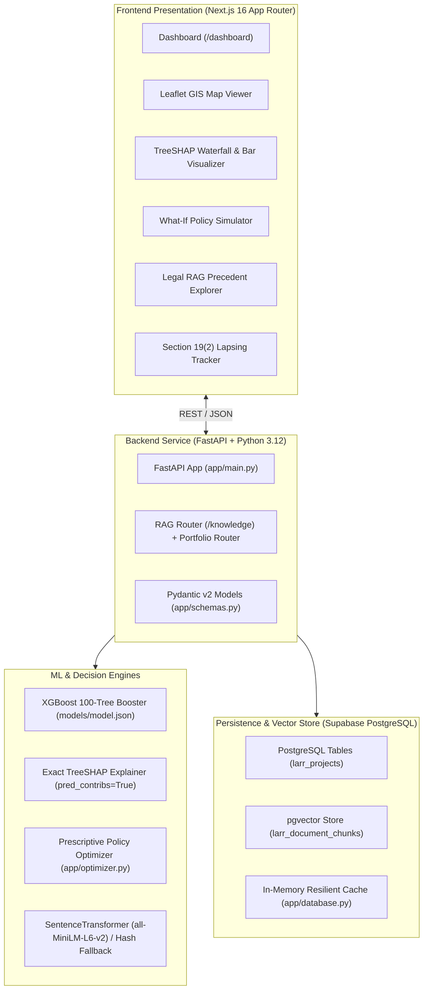

# 🏛️ CONTEXT MEMORY: DoLR LARR Act 2013 Predictive Analytics Platform
> **System Memory & Single Source of Truth for Autonomous Agentic Development**  
> **Hackathon Track**: Smart India Hackathon (SIH 2026) — Problem Statement **SIH26017**  
> **Governing Entity**: Department of Land Resources (DoLR), Ministry of Rural Development, Government of India  
> **Core Statute**: Right to Fair Compensation and Transparency in Land Acquisition, Rehabilitation and Resettlement Act, 2013 (RFCTLARR / LARR Act 2013)  
> **Last Updated**: 2026-09-19 | **Version**: 2.0.0 Production-Ready Architecture

---

## 1. Executive Purpose & Problem Domain

### 1.1 The Challenge
Infrastructure projects across India (National Highways, Dedicated Freight Corridors, Industrial Hubs, Irrigation Networks, Solar Parks) routinely suffer catastrophic delays and cost escalations. Over **₹4.8+ Lakh Crore** worth of national assets are immobilized due to procedural, legal, and financial hurdles in land acquisition.

### 1.2 The Statutory Bottlenecks (RFCTLARR Act 2013)
- **Section 19(2) 12-Month Lapsing Guillotine**: If the Section 19 Final Declaration is not published within exactly 12 months (365 days) of the Section 11 Preliminary Notification, the entire acquisition proceeding **lapses by operation of law**, wiping out all prior work, surveys, and investments.
- **Section 15 Citizen Objections Backlog**: Landowners and livelihood dependants file legal objections regarding public purpose, displacement, or parcel demarcations. If hearings and District Collector disposal reports drag on, the project slips past statutory milestones.
- **Valuation & Circle Rate Disparity (Section 26)**: Government circle/ready-reckoner rates frequently lag real market prices by $2\times$ to $5\times$. Landowners refuse acquisition, triggering Section 64 reference litigation in High Courts.
- **Section 41 & 42 Tribal Safeguards (Scheduled Areas)**: Mandatory prior consent of Gram Sabhas in Fifth and Sixth Schedule areas. Procedural non-compliance leads to immediate judicial injunctions and stay orders.
- **Section 10 Food Security Restrictions**: Strict limitations on acquiring irrigated multi-cropped agricultural land unless exceptional public interest criteria are satisfied.

### 1.3 The Platform Solution
An explainable, predictive decision-support system that:
1. Predicts acquisition delay probability and expected delay duration using a pre-trained **XGBoost 100-Tree Classifier**.
2. Deconstructs the prediction into **Exact TreeSHAP attributions**, removing black-box ambiguity.
3. Automatically triggers **prescriptive statutory remedies** (e.g. Section 26 Direct Negotiations, Section 15 Hearing Benches).
4. Enables interactive **Counterfactual What-If Simulations** to measure risk reduction before enacting policy.
5. Ingests citizen objections and High Court case law via a **Dynamic Semantic Legal RAG** (`pgvector`).
6. Visualizes acquisition corridors on an interactive **GIS Leaflet Map**.

---

## 2. Global Architecture & Technology Stack



### 2.1 Technology Matrix
| Layer | Technologies / Libraries | Key Responsibility |
| :--- | :--- | :--- |
| **Frontend** | Next.js 16 (React 19), Tailwind CSS, Lucide React, Recharts, Leaflet / React-Leaflet | Executive command center, real-time interactive charts, geospatial mapping, what-if sliders. |
| **Backend** | FastAPI, Uvicorn, Pydantic v2, Python 3.12 | REST API, CORS middleware, data validation, endpoint orchestration. |
| **ML Engine** | XGBoost (`xgboost.Booster`), NumPy, Pandas | Multi-head inference: delay probability, survival delay days, Section 19(2) lapse risk, stage-wise hazard. |
| **Explainability** | TreeSHAP (`booster.predict(pred_contribs=True)`) | Exact mathematical feature attribution without sampling noise. |
| **Semantic RAG** | SentenceTransformers (`all-MiniLM-L6-v2`), pgvector, Cosine Search | Retrieval of legal precedents, court stay orders, and Section 15 citizen objection records. |
| **Database** | PostgreSQL (Supabase), pgvector extension, psycopg2-binary | Storing projects, milestones, vector chunks, and legal metadata. |

---

## 3. The Uploaded ML Model (`models/model.json`)

### 3.1 Physical Location & Loading Hierarchy
The model file is stored at:
`c:\Projects\SIH\backend\models\model.json`

The backend engine (`app/ml_engine.py`) searches and loads this model dynamically using the following priority paths:
1. `settings.CUSTOM_MODEL_PATH` (defined in `.env`)
2. `models/model.json`
3. `backend/models/model.json`
4. `c:/Projects/SIH/backend/models/model.json`

```python
booster = xgb.Booster()
booster.load_model(path)
self.booster = booster
```

### 3.2 Model Structure & Specifications
- **Format**: Native XGBoost JSON serialization (`xgboost.Booster`).
- **Estimator Type**: Binary Classification (`_estimator_type: "classifier"`).
- **Ensemble**: **100 Boosted Decision Trees** (`num_trees: 100`, `num_parallel_tree: 1`).
- **Input Dimension**: Exactly **14 continuous and integer features**.
- **Internal Structure**: Each tree contains split conditions, split indices referencing the 14 features, loss changes, and sum hessians.
- **Memory Footprint**: ~60.2 KB on disk, near-instantaneous memory load (< 15ms).

### 3.3 The 14 Invariable Model Features
The ML Booster requires features to be passed in **exact chronological order**:

| # | Feature Name | Data Type | Statutory / Physical Meaning | Realistic Value Range |
| :---: | :--- | :---: | :--- | :--- |
| **1** | `total_acreage_ha` | `float` | Total acquisition footprint in hectares. Large footprints increase survey and titling drag. | $10.0 - 5,000.0$ ha |
| **2** | `num_land_parcels` | `int` | Cadastral fragmentation (number of individual survey/khasra numbers). | $20 - 10,000$ parcels |
| **3** | `private_to_govt_ratio` | `float` | Ratio of private deeded land to state/revenue land. Higher ratio implies heavier compensation overhead. | $0.2 - 10.0$ |
| **4** | `sc_st_land_percentage` | `float` | Proportion of land belonging to Scheduled Castes / Scheduled Tribes (triggers Sec 41/42 protections). | $0.0 - 100.0\%$ |
| **5** | `multi_crop_irrigated_percentage` | `float` | Agricultural food-security threshold (triggers Sec 10 statutory acquisition restrictions). | $0.0 - 100.0\%$ |
| **6** | `required_consent_percentage` | `int` | Mandatory prior landowner consent under Section 2(2) ($0\%$ for Govt, $70\%$ for PPP, $80\%$ for Private). | $0, 70, \text{ or } 80\%$ |
| **7** | `non_owner_to_owner_paf_ratio` | `float` | Ratio of tenant farmers, agricultural labourers, and artisans to registered titleholders (Sec 3(c) R&R claims). | $0.0 - 3.0$ |
| **8** | `circle_rate_disparity_ratio` | `float` | Market value divided by government circle rate ($\text{Market Rate} / \text{Circle Rate}$). Critical litigation trigger. | $1.0 - 5.0\times$ |
| **9** | `rr_cost_share_percentage` | `float` | Share of Rehabilitation and Resettlement entitlements relative to pure land compensation cost. | $5.0 - 45.0\%$ |
| **10** | `rural_multiplier_factor` | `float` | Statutory rural multiplier applied to base market value pursuant to Section 26(2) and First Schedule. | $1.0 - 2.0\times$ |
| **11** | `district_litigation_rate` | `float` | Historical district rate of land acquisition writ petitions and references per 1,000 hectares. | $0.5 - 25.0$ |
| **12** | `revenue_staff_vacancy_rate` | `float` | Shortage of Patwaris, Kanungos, and surveyors in the District Collectorate survey branch. | $0.0 - 60.0\%$ |
| **13** | `avg_s15_resolution_days` | `float` | Average days taken by the Collectorate to hear, report, and dispose of Section 15 citizen objections. | $15.0 - 180.0$ days |
| **14** | `days_since_s11` | `int` | **Dynamically computed statutory feature**: calendar days elapsed since Section 11 Notification was published. | $0 - 730$ days |

### 3.4 Multi-Head Inference Mechanics
When `ml_engine.predict_delay(features)` is called:
1. **Dynamic Derived Feature Calculation**:
   $$\text{days\_since\_s11} = \max(0, (\text{today} - \text{s11\_notification\_date}).\text{days})$$
   $$\text{days\_remaining\_s19} = 365 - \text{days\_since\_s11}$$
2. **Booster Prediction**:
   - Features are formatted into a single-row Pandas DataFrame and converted to `xgb.DMatrix(df)`.
   - `raw_pred = booster.predict(dmatrix)` returns the predicted delay probability $P \in [0.0, 1.0]$.
   - If the Booster is unavailable, an engineered, empirically-calibrated logit baseline executes as a failsafe.
3. **Risk Categorization**:
   - **LOW**: $P < 0.35$
   - **MEDIUM**: $0.35 \le P < 0.70$
   - **CRITICAL**: $P \ge 0.70$
4. **Time-to-Event Head (Expected Delay Days)**:
   $$E[\text{Delay Days}] = \text{int}(P \times 180 + (\text{circle\_disparity} - 1.0) \times 45 + (\text{staff\_vacancy} / 10.0) \times 12 + \text{s15\_avg\_days} \times 0.5)$$
5. **Section 19(2) Statutory Lapsing Risk Flag**:
   - If `s19_declaration_date` is `None` AND (`days_remaining_s19 <= 60` or `days_since_s11 >= 300`), `lapsing_risk_s19` is set to `True`.
6. **Stage-Wise Hazard Profile**:
   Computes individual hazard scores across 5 statutory gates:
   - Section 11 Notification
   - Section 15 Citizen Hearing
   - Section 19 Declaration (12-mo Limit)
   - Section 23 Compensation Award
   - Section 38 Physical Possession

---

## 4. Explainable AI: Exact TreeSHAP Engine

### 4.1 Zero-Approximation Attribution
Unlike model-agnostic SHAP approaches (KernelSHAP) which sample exponentially and add approximation variance, this system computes **exact TreeSHAP** directly inside the XGBoost C++ engine:
```python
contribs = self.booster.predict(dmatrix, pred_contribs=True)[0]
# contribs layout: [shap_f0, shap_f1, ..., shap_f13, base_logit_bias]
```
- The sum of all SHAP values plus the base logit bias equals the exact raw margin output of the tree ensemble.
- `base_value = 1.0 / (1.0 + np.exp(-contribs[-1]))` provides the unconditioned base probability.

### 4.2 Statutory Driver Categorization
The 14 features are classified into **5 Administrative & Statutory Driver Families**:
1. **Compensation**: `circle_rate_disparity_ratio`, `rr_cost_share_percentage`, `rural_multiplier_factor`.
2. **Administrative**: `revenue_staff_vacancy_rate`, `days_since_s11`, `avg_s15_resolution_days`.
3. **Legal**: `multi_crop_irrigated_percentage`, `district_litigation_rate`, `required_consent_percentage`.
4. **R&R (Rehabilitation & Resettlement)**: `sc_st_land_percentage`, `non_owner_to_owner_paf_ratio`.
5. **Documentation**: `num_land_parcels`, `total_acreage_ha`, `private_to_govt_ratio`.

---

## 5. Prescriptive Optimization & What-If Simulations

### 5.1 Root-Cause to Statutory Remedy Mapping
The Prescriptive Optimizer (`app/optimizer.py`) evaluates positive SHAP risk contributors and generates concrete administrative orders anchored in the RFCTLARR Act 2013:
- **Circle Rate Disparity ($> 0.03$ SHAP impact)** $\rightarrow$ **Section 26 (Proviso 4)** Direct Negotiation Committee under District Collector with 100% solatium (Section 30).
- **Revenue Staff Shortage ($> 0.03$ SHAP impact)** $\rightarrow$ Requisition Emergency Surveyor Squad on Deputation to fast-track Section 12 demarcations.
- **Objection Latency ($> 0.02$ SHAP impact)** $\rightarrow$ Appoint Additional Deputy Collector for dedicated Section 15 hearing windows (< 15 days).
- **Tribal Land Safeguards ($> 0.03$ SHAP impact)** $\rightarrow$ Section 41/42 Gram Sabha dialect consultations with District Tribal Welfare Officer.
- **Multi-Crop Cap ($> 0.03$ SHAP impact)** $\rightarrow$ Procure Section 10(2) Exceptional Public Interest Exemption certificate.

### 5.2 Counterfactual What-If Simulation
The `/simulate` endpoint accepts a baseline project profile and a list of `resolved_factors`. It mathematically adjusts the levers (e.g. setting circle rate disparity to $1.0$, reducing staff vacancy to $5\%$) and re-runs the XGBoost Booster to output:
- Original vs. Simulated Risk Score
- Original vs. Simulated Expected Delay Days
- Exact Percentage Risk Reduction ($\Delta R$)
- Exact Days of Statutory Timeline Saved

---

## 6. Dynamic Semantic Legal RAG Knowledge Base

### 6.1 Purpose
Stores and searches unstructured legal texts, High Court stay orders, Section 15 objection reports, and DoLR executive circulars.

### 6.2 Architecture
- **Embedding Model**: `all-MiniLM-L6-v2` (384-dimensional dense semantic vectors) via `sentence-transformers`.
- **Resilient Fallback**: A 384D token-hash embedding projection with unigram and bigram feature hashing ensures vector search operates even when deep learning dependencies are unavailable.
- **PostgreSQL Vector Table (`larr_document_chunks`)**:
  ```sql
  CREATE TABLE larr_document_chunks (
      id UUID PRIMARY KEY DEFAULT uuid_generate_v4(),
      project_id UUID REFERENCES larr_projects(id) ON DELETE CASCADE,
      document_type VARCHAR(100) NOT NULL,
      document_title VARCHAR(255) NOT NULL,
      chunk_content TEXT NOT NULL,
      chunk_index INTEGER NOT NULL,
      embedding vector(384)
  );
  ```
- **Vector Search Query**:
  Uses the Cosine distance operator (`<=>`):
  ```sql
  SELECT document_title, document_type, chunk_content, 
         1 - (embedding <=> %s::vector) AS similarity
  FROM larr_document_chunks
  ORDER BY embedding <=> %s::vector
  LIMIT %s;
  ```
- **Memory Fallback**: When PostgreSQL is disconnected, uses an internal cosine similarity search over `db_manager.in_memory_documents`.

---

## 7. Backend API Specification & Endpoints

| Method | Path | Request Body | Response Schema | Purpose |
| :--- | :--- | :--- | :--- | :--- |
| `GET` | `/` | None | Service status JSON | Health check, DB connectivity, cached project count. |
| `GET` | `/portfolio` | Query params (`state`, `district`, `risk_band`) | `PortfolioOverview` | Aggregated portfolio stats, risk distributions, projects list with live ML scores. |
| `POST` | `/predict` | `ProjectFeatures` | `DelayPredictionResponse` | Multi-head ML delay prediction, survival days, lapsing risk. |
| `POST` | `/explain` | `ProjectFeatures` | `ShapExplanationResponse` | Exact TreeSHAP factors and 5-category driver breakdown. |
| `POST` | `/optimize` | `ProjectFeatures` | `PrescriptiveResponse` | Tailored administrative action plans and Google Docs sync. |
| `POST` | `/simulate` | `WhatIfSimulationRequest` | `WhatIfSimulationResponse` | Counterfactual policy what-if simulation and risk delta. |
| `POST` | `/knowledge/ingest` | Multipart Form (`project_id`, `document_title`, `document_type`, `file`) | Status JSON | Chunks document, computes 384D vectors, stores in DB. |
| `POST` | `/knowledge/query` | `RagQueryRequest` (`query_text`, `top_k`) | `RagQueryResponse` | Vector similarity search over legal precedents & stay orders. |

---

## 8. Frontend Architecture & Component Hierarchy

```text
frontend/src/
├── app/
│   ├── layout.tsx                # Root layout with Tailwind styling & fonts
│   ├── page.tsx                  # Home landing redirect to dashboard
│   └── dashboard/
│       └── page.tsx              # Executive Command Center (Main Dashboard)
├── components/
│   ├── NavigationHeader.tsx       # Top bar with DoLR branding & live stats
│   ├── PortfolioMetrics.tsx       # KPI cards (Critical Projects, Lapsing Count, Total Delay)
│   ├── GisMapViewer.tsx           # Leaflet map rendering GIS markers & risk corridors
│   ├── ShapExplanationVisualizer.tsx # Recharts waterfall & horizontal bar charts for TreeSHAP
│   ├── WhatIfSimulator.tsx        # Interactive sliders for counterfactual simulations
│   ├── PrescriptiveSolutionsCard.tsx # Actionable statutory blueprints & legal citations
│   ├── LegalRagConsole.tsx        # Search interface for court stay orders & precedents
│   ├── LapsingAlertTracker.tsx    # Real-time countdown for Section 19(2) 12-month limit
│   └── ProjectDetailModal.tsx     # Comprehensive project drawer with full statutory audits
├── services/
│   └── api.ts                    # Axios client connecting to FastAPI backend
└── types/
    └── index.ts                  # TypeScript interfaces matching backend Pydantic schemas
```

---

## 9. Invariants & Rules for Autonomous Agents

When modifying, extending, or maintaining this codebase, future agents **MUST adhere to the following rules**:

1. **Preserve the 14-Feature Input Sequence**:
   The XGBoost model (`models/model.json`) was trained with a strict 14-feature sequence. **Never change the order, names, or number of features** in `LarrMlEngine.feature_names` or `_features_to_dataframe`. Doing so will silently corrupt the feature attribution matrix.
2. **Statutory Integrity of `days_since_s11`**:
   `days_since_s11` is always derived dynamically from `today - s11_notification_date`. It must never be manually overridden with an arbitrary static number during standard inference.
3. **TreeSHAP Exactness**:
   Always prefer `booster.predict(dmatrix, pred_contribs=True)` for SHAP values. Do NOT substitute with heavy sampling libraries (like `shap.Explainer`) on runtime request paths, as they introduce severe API latency.
4. **Vector Embedding Dimension**:
   All embeddings in pgvector and memory must strictly use **384 dimensions** (matching `all-MiniLM-L6-v2`).
5. **Resilient Dual-Mode Operation**:
   Every database or model interaction must contain a graceful fallback (in-memory projects, token-hash embedding projection, baseline logit calculation) so the application remains 100% operational in disconnected or demo environments.
6. **Frontend State Synchronization**:
   When a project is selected in `dashboard/page.tsx`, its state must uniformly propagate to the `ShapExplanationVisualizer`, `WhatIfSimulator`, `PrescriptiveSolutionsCard`, and `GisMapViewer`.

---
*Document maintained by Antigravity Agent for long-run autonomous development across sessions.*
## 10. Production GCP MLOps Architecture & Real-World Training Data Specifications

### 10.1 Real-World Data Sources for Model Retraining
To transition from synthetic data (1,000 samples) to real, factual, production-grade ground truth:
1. **MoSPI OCMS (Online Computerized Monitoring System)**: Historical ground-truth project delays, revised commissioning dates, and delay attribution tags for all Central Sector projects > Rs 150 Cr.
2. **Bhoomi Rashi Portal (MoRTH / NHAI)**: Real statutory milestones (Sec 3A/11 notifications, Sec 3D/19 declarations, Sec 3G/23 awards), total acreage, parcel counts, and compensation amounts.
3. **e-Courts NJDG (National Judicial Data Grid)**: District-level land acquisition writ petition volumes, stay orders, and Section 64 reference litigation rates.
4. **State IGR & Revenue Portals (Mahabhulekh, BanglarBhumi, IGRUP, Kaveri)**: Registered sale deed transaction rates vs. government notified circle rates to compute real-time circle rate disparity ratios.
5. **District Cadastral & Tribal Census (DoLR & Census India)**: Scheduled Area notifications (Fifth/Sixth Schedule), SC/ST village parcel percentages, and agricultural multi-crop ceiling records.
6. **State Land Revenue Cadre Reports**: Actual administrative survey staff vacancies (Patwaris, Kanungos, SLAO staff) per district.

### 10.2 GCP Continuous Learning Architecture
`mermaid
flowchart LR
    subgraph Ingestion ["1. Automated Ingestion"]
        CRON["Cloud Scheduler"] --> RUN["Cloud Run Job (Scrapers & Connectors)"]
        RUN --> BQ["BigQuery Raw Staging"]
    end

    subgraph FeatureStore ["2. Feature Pipeline"]
        BQ --> DATAFLOW["Dataflow / dbt (Feature Transformation)"]
        DATAFLOW --> VFS["Vertex AI Feature Store"]
    end

    subgraph Pipeline ["3. Vertex AI CT Pipeline"]
        VFS --> KFP["Kubeflow Pipelines / Vertex Pipelines"]
        KFP --> TRAIN["XGBoost Hyperparameter Tuning"]
        TRAIN --> EVAL["Champion/Challenger Model Evaluation"]
        EVAL --> REG["Vertex AI Model Registry"]
    end

    subgraph Serving ["4. Scalable Serving"]
        REG --> CLOUD_RUN["Cloud Run (FastAPI + TreeSHAP Engine)"]
        CLOUD_RUN --> MON["Vertex AI Model Monitoring (Drift / PSI)"]
        MON -.->|Triggers Retraining| KFP
    end
`

### 10.3 Model Drift & Automated Retraining Triggers
- **Data Drift Detection**: Vertex AI Model Monitoring computes Population Stability Index (PSI) and Wasserstein Distance across the 14 features every 24 hours.
- **Concept Drift Trigger**: When real milestone awards (Sec 19/23) are published and ground-truth delay deviates from prediction by > 20%, automated pipeline execution is triggered via Cloud Pub/Sub.
- **Canary Rollout**: New challenger models are deployed with a 10% traffic split on Cloud Run, promoting to 100% only if log-loss and F1-score outperform the current champion.
---

## 11. Exhaustive Feature, Component & API Audit (Zero-File-Scan Single Source of Truth)

> **AGENT NOTICE**: Any AI agent operating on this repository must read this section to understand the entire system state, all routes, all UI components, and all data contracts without needing to scan individual files.

### 11.1 Complete Frontend Component Catalog
| Component File | Role / Purpose | Key Props / Contracts | Critical Invariants |
| :--- | :--- | :--- | :--- |
| [rontend/src/app/page.tsx](file:///c:/Projects/SIH/frontend/src/app/page.tsx) | Executive Command Hub & Root Controller | Holds active state (selectedState, selectedRisk, ctiveTab, selectedProject, portfolio, isCustomModalOpen). Orchestrates tab switching. | When a new project is created or selected, it immediately updates selectedProject and triggers etchData(). |
| [rontend/src/components/NavigationHeader.tsx](file:///c:/Projects/SIH/frontend/src/components/NavigationHeader.tsx) | Government Authority Header & Quick Controls | Props: selectedState, selectedRisk, ctiveTab, criticalAlertCount, onOpenCustomModal, onGenerateSynthetic, onRefresh. | Features an official session badge (TOKEN #26017-GOI, CALA session indicator) and the **+ Evaluate Custom Project** button. |
| [rontend/src/components/CustomProjectModal.tsx](file:///c:/Projects/SIH/frontend/src/components/CustomProjectModal.tsx) | **[NEW] Interactive Judicial / CALA Evaluator** | Props: isOpen, onClose, onProjectCreated(Project). Provides 3 one-click realistic case presets (*Tribal Corridor*, *Circle Rate Crisis*, *Low-Risk Solar*). | Calls pi.predictDelay, pi.getShapExplanation, and pi.getPrescriptions dynamically. Allows one-click injection into the live portfolio. |
| [rontend/src/components/PortfolioMetrics.tsx](file:///c:/Projects/SIH/frontend/src/components/PortfolioMetrics.tsx) | National Executive KPI Cards | Props: data: PortfolioData, loading: boolean. Displays: Total Acreage (ha), Total Outlay Under Monitoring (₹Cr), Mean Survival Delay (days), Section 19(2) Lapsing Count. | Includes a real-time risk distribution bar (LOW / MEDIUM / CRITICAL percentages). |
| [rontend/src/components/GisMapViewer.tsx](file:///c:/Projects/SIH/frontend/src/components/GisMapViewer.tsx) | Geospatial Corridor & Boundary Visualizer | Props: projects: Project[], selectedProject: Project, onSelectProject(Project). Uses Leaflet & OpenStreetMap tiles. | Markers are dynamically color-coded: Green (LOW), Amber (MEDIUM), Rose (CRITICAL). Clicking a marker updates global active project. |
| [rontend/src/components/ShapExplanationVisualizer.tsx](file:///c:/Projects/SIH/frontend/src/components/ShapExplanationVisualizer.tsx) | Exact TreeSHAP Factor Attributions | Props: project: Project. Fetches pi.getShapExplanation(project). Renders horizontal bar charts of positive/negative SHAP values and pie breakdown. | Decomposes raw Shapley attributions into the 5 statutory families: Compensation, Administrative, Legal, R&R, Documentation. |
| [rontend/src/components/WhatIfSimulator.tsx](file:///c:/Projects/SIH/frontend/src/components/WhatIfSimulator.tsx) | Counterfactual Policy Intervention Simulator | Props: project: Project. Dispatches pi.simulateWhatIf(project, resolvedFactors). Sliders for Circle Disparity, Vacancies, Objections. | Computes exact mathematical risk drop ($\Delta R$) and statutory calendar days saved in real time. |
| [rontend/src/components/PrescriptiveSolutionsCard.tsx](file:///c:/Projects/SIH/frontend/src/components/PrescriptiveSolutionsCard.tsx) | Actionable Administrative Remedy Engine | Props: project: Project. Fetches pi.getPrescriptions(project). Displays legal basis (e.g. Sec 26 Proviso 4, Sec 15(2), Sec 41). | Contains a Google Docs live synchronization button triggering doc_sync.py via FastAPI. |
| [rontend/src/components/LapsingAlertTracker.tsx](file:///c:/Projects/SIH/frontend/src/components/LapsingAlertTracker.tsx) | Section 19(2) 12-Month Countdown & Alert Desk | Props: lerts: Alert[]. Renders emergency cards for projects within 60 days of lapsing or with circle rate disparity > 2.5x. | Features pulsating emergency banners and statutory days remaining countdown. |
| [rontend/src/components/ProjectDetailModal.tsx](file:///c:/Projects/SIH/frontend/src/components/ProjectDetailModal.tsx) | Comprehensive Project Audit Drawer | Props: project: Project, onClose(), onViewDiagnostics(), onViewPrescriptions(). | Displays complete cadastral, spatial, statutory dates, and financial breakdown of an individual project. |

---

### 11.2 Complete Backend API Route Audit
| HTTP Method | Route Endpoint | Request Schema | Response Schema | Purpose & Behavior |
| :--- | :--- | :--- | :--- | :--- |
| GET | / | None | dict | Service health, version, database status, and active project count. |
| GET | /portfolio | Query params: state, district, 
isk_band | PortfolioOverview | Calculates real-time ML risk scores for all projects in portfolio and aggregates metrics. |
| GET | /projects/{id} | Path param: project_id | dict (Project) | Retrieves full record of a single project by ID or project code. |
| POST | /projects | **[NEW]** ProjectFeatures | dict (Project) | **Evaluates & Registers custom project.** Runs ML inference, derives dates, prepends to active portfolio. |
| POST | /predict | ProjectFeatures | DelayPredictionResponse | Runs multi-head inference: delay probability, risk category, expected delay days, Section 19(2) lapse. |
| POST | /shap-explain | ProjectFeatures | ShapExplanationResponse | Exact TreeSHAP factor attributions via pred_contribs=True and 5-family breakdown. |
| POST | /prescribe-optimize | ProjectFeatures | PrescriptiveResponse | Prescribes actionable legal blueprints and optionally syncs executive brief to Google Docs. |
| POST | /simulate-whatif | WhatIfSimulationRequest | WhatIfSimulationResponse | Counterfactual simulation calculating $\Delta R$ and delay days saved when levers are resolved. |
| GET | /alerts | None | List[AlertItem] | Generates active statutory lapsing and compensation dispute alerts across portfolio. |
| POST | /projects/generate-synthetic | Query param: count (1-50) | dict | Generates and appends MoSPI-anchored synthetic project records. |
| POST | /knowledge/ingest | Multipart Form (project_id, document_title, document_type, ile) | dict | Chunks document, computes 384D dense vectors, inserts into larr_document_chunks (pgvector). |
| POST | /knowledge/query | RagQueryRequest (query_text, 	op_k) | RagQueryResponse | Cosine similarity vector search over court precedents, stay orders, and Section 15 objections. |

---

### 11.3 Strict 14-Feature Input Sequence (Invariable)
The XGBoost booster at [ackend/models/model.json](file:///c:/Projects/SIH/backend/models/model.json) was compiled with these 14 features in strict chronological order:
1. 	otal_acreage_ha (float): Total acquisition footprint in hectares.
2. 
um_land_parcels (int): Number of cadastral khasra/survey numbers.
3. private_to_govt_ratio (float): Ratio of private deeded land to government revenue land.
4. sc_st_land_percentage (float): Tribal land percentage subject to Section 41/42 consent.
5. multi_crop_irrigated_percentage (float): Agricultural food security cap under Section 10.
6. 
equired_consent_percentage (int): Statutory consent hurdle (0%, 70%, or 80%).
7. 
on_owner_to_owner_paf_ratio (float): Livelihood dependants to titleholders (Section 3(c)).
8. circle_rate_disparity_ratio (float): Market value divided by circle rate ($\text{Market} / \text{Circle}$).
9. 
r_cost_share_percentage (float): Proportion of R&R cost to total acquisition cost.
10. 
ural_multiplier_factor (float): Multiplier applied to market value (.0\times - 2.0\times$).
11. district_litigation_rate (float): Historical district writ petitions/stays per 1,000 ha.
12. 
evenue_staff_vacancy_rate (float): Surveyor/Patwari vacancies in the District Collectorate.
13. vg_s15_resolution_days (float): Average latency to dispose of citizen objections.
14. days_since_s11 (int): **Dynamically derived**: $\max(0, \text{today} - \text{s11\_notification\_date})$.

---

### 11.4 Production Retraining Script
- File: [ackend/scripts/train_production_model.py](file:///c:/Projects/SIH/backend/scripts/train_production_model.py)
- Command: python train_production_model.py --samples 5000 --export-path backend/models/model.json
- Supports --data-path for real CSVs, performs 5-fold cross-validation with GridSearchCV, evaluates ROC-AUC and F1, exports model.json, and writes model_card.json.

### 11.5 Render & Container Deployment Blueprint
- **Blueprint File**: [
ender.yaml](file:///c:/Projects/SIH/render.yaml)
- **Container File**: [ackend/Dockerfile](file:///c:/Projects/SIH/backend/Dockerfile)
- **CPU-Optimized Requirements**: [ackend/requirements-render.txt](file:///c:/Projects/SIH/backend/requirements-render.txt)
  - Uses --extra-index-url https://download.pytorch.org/whl/cpu to install CPU-only PyTorch wheel (~150MB instead of 800MB CUDA).
  - Keeps total runtime RAM consumption at ~180MB, well below Render's 512MB free tier ceiling.
