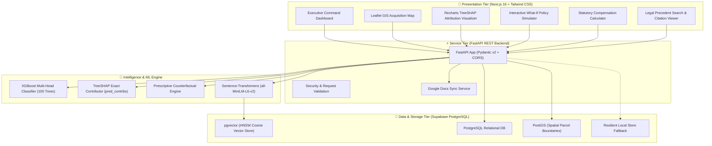

# 🏛️ DoLR LARR Act 2013 Predictive Analytics & Decision-Support System

[](https://www.sih.gov.in/)
[](https://www.sih.gov.in/)
[](https://dolr.gov.in/)
[](https://nextjs.org/)
[](https://fastapi.tiangolo.com/)
[](https://xgboost.readthedocs.io/)
[](https://github.com/pgvector/pgvector)

An enterprise-grade, explainable Artificial Intelligence & Legal RAG decision-support platform designed for the **Department of Land Resources (DoLR), Ministry of Rural Development, Government of India**, to proactively identify, explain, and mitigate land acquisition project delays under the **Right to Fair Compensation and Transparency in Land Acquisition, Rehabilitation and Resettlement Act, 2013 (RFCTLARR / LARR Act 2013)**.

---

## 📌 Problem Statement Overview (SIH26017)

Land acquisition for major national infrastructure (highways, rail corridors, industrial zones, renewable energy parks) in India faces systemic statutory bottlenecks, court stay orders, circle rate disparity litigation, and Social Impact Assessment (SIA) hurdles. Over **₹4.8+ Lakh Crore** worth of national infrastructure is stalled due to:

1. **Statutory Time-Bar Lapses**: Strict 12-month deadlines under **Section 19(2)** between Section 11 Preliminary Notification and Section 19 Final Declaration, leading to complete proceedings lapsing.
2. **Compensation & Valuation Disputes**: Circle rate disparities versus actual transaction values triggering avalanche objections under **Section 15** and references under **Section 64**.
3. **Fifth/Sixth Schedule Tribal Land Violations**: Mandatory Gram Sabha consent requirements under **Section 41/42** frequently contested in High Courts.
4. **Lack of Early Predictive Intervention**: Land Acquisition Officers (CALA / SLAO) and Central Ministries lack an automated intelligence layer that quantifies delay probability, pinpoints root-cause statutory drivers, and prescribes legally actionable remedies before statutory timelines lapse.

---

## 🌟 Key Platform Capabilities

### 1. 🧠 Multi-Head Predictive ML Engine
- **Pre-trained 100-Tree Gradient Boosted Model (`XGBoost`)**: Ingests 14 core statutory, spatial, and financial project features (tribal area flags, forest clearance status, circle rate disparity ratio, citizen objection density, court stay indicators, multi-crop land ratio, and stage-wise progress).
- **Dual Hazard Estimation**: Computes both overall delay probability ($0-100\%$) and Discrete-Time Survival Hazard Analysis providing estimated delay duration in days ($E[\text{Delay Days}]$).

### 2. 🔍 Exact TreeSHAP Explainable AI (XAI)
- **Zero Black-Box Ambiguity**: Computes exact Shapley attribution values directly via `xgb.Booster.predict(pred_contribs=True)`.
- **4 Statutory Driver Families**: Organizes feature attributions into statutory administrative categories:
  - 🏛️ *Statutory & Regulatory Timelines* (Sec 19(2) deadline proximity, SIA completion days)
  - ⚖️ *Litigation & Legal Obstacles* (Court stay orders, Section 15 objections per hectare)
  - 💰 *Valuation & Compensation Disparity* (Circle rate disparity ratio, Solatium allocation)
  - 🌿 *Social, Environmental & Tribal Compliance* (Sec 41/42 tribal consent, forest clearances, multi-crop restrictions under Sec 10)

### 3. 🎯 Counterfactual Prescriptive What-If Policy Optimizer
- Simulates real-time statutory policy interventions:
  - *Increasing compensation multipliers (Section 26)*
  - *Deploying fast-track Section 15 objection resolution special benches*
  - *Expediting Gram Sabha tribal consent protocols (Section 41)*
  - *Accelerating Section 12 preliminary survey demarcations*
- Quantifies exact **$\Delta$ Risk Reduction (%)** and **Statutory Days Saved**.
- Automatically generates executive administrative advisory memos.

### 4. 📚 Dynamic Legal Semantic RAG (`pgvector` + `all-MiniLM-L6-v2`)
- High-performance vector retrieval indexing landmark High Court & Supreme Court precedents, High Court stay orders, Section 15 objection rulings, and tribal compensation jurisprudence.
- Utilizes `pgvector` with HNSW Cosine Indexing and dense semantic embedding fallbacks.

### 5. 🗺️ Geospatial GIS Hotspot & Cadastral Mapping
- Interactive Leaflet-powered GIS dashboard rendering high-risk acquisition corridors, tribal Fifth Schedule zones, forest clearance buffers, and circle rate disparity heatmaps.

### 6. 🧮 Section 26-30 Statutory Compensation Engine
- Automated computation of Base Market Value, Rural Multiplier ($1.00\times - 2.00\times$), 100% Solatium (**Section 30(1)**), and 12% per annum Additional Compensation from Section 11 Notification to Award date (**Section 30(3)**).

### 7. 🔄 End-to-End Acquisition Workflow Tracker
- Real-time progress monitoring across all statutory stages:
  $$\text{SIA Prep} \rightarrow \text{Sec 11 Notification} \rightarrow \text{Sec 15 Objections} \rightarrow \text{Sec 19 Declaration} \rightarrow \text{Sec 26-30 Award} \rightarrow \text{Sec 38 Possession}$$

### 8. 📄 Live Google Docs Advisory Memo Sync
- Direct synchronization of prescriptive risk mitigation memos into shared Google Docs for inter-ministerial task forces and District Collectors.

---

## 🏗️ System Architecture



---

## 🛠️ Technology Stack

| Layer | Technologies |
| :--- | :--- |
| **Frontend Framework** | [Next.js 16.3.4](https://nextjs.org/) (App Router, Turbopack, React 19) |
| **Styling & Icons** | Tailwind CSS 4, Lucide React, Glassmorphism UI tokens |
| **Visualizations & GIS** | Recharts 2.15, Leaflet 1.9, React-Leaflet |
| **Backend Framework** | [FastAPI](https://fastapi.tiangolo.com/) (Python 3.12, Uvicorn, Pydantic v2) |
| **Machine Learning** | [XGBoost](https://xgboost.readthedocs.io/), TreeSHAP, Scikit-learn, NumPy |
| **Embeddings & NLP** | [Sentence-Transformers](https://www.sbert.net/) (`all-MiniLM-L6-v2`), PyTorch, HuggingFace Hub |
| **Database & Vectors** | PostgreSQL 16, [Supabase](https://supabase.com/), `pgvector` (HNSW Index), `postgis` |
| **Document Synchronization** | Google Docs API v1, Google Cloud Service Account OAuth2 |

---

## 📁 Repository Structure

```
SIH/
├── backend/
│   ├── app/
│   │   ├── __init__.py
│   │   ├── main.py              # FastAPI application entrypoint & REST routing
│   │   ├── schemas.py           # Pydantic v2 validation models
│   │   ├── ml_engine.py         # XGBoost inference & TreeSHAP attributions
│   │   ├── ingestion.py         # pgvector legal document RAG chunking & vector search
│   │   ├── database.py          # PostgreSQL / Supabase connection manager
│   │   └── google_docs_sync.py  # Google Docs automated memo sync
│   ├── models/
│   │   └── model.json           # Pre-trained 100-tree XGBoost model artifact
│   ├── tests/
│   │   └── test_api.py          # Backend test suite
│   ├── requirements.txt         # Python dependencies
│   ├── .env.example             # Backend environment template
│   └── .env                     # Local environment configuration (git-ignored)
├── frontend/
│   ├── app/
│   │   ├── layout.tsx           # Root layout & Google Inter font
│   │   ├── page.tsx             # Executive command center dashboard
│   │   └── globals.css          # Tailwind CSS styling tokens
│   ├── package.json             # Frontend dependencies & scripts
│   ├── tsconfig.json            # TypeScript configuration
│   └── next.config.ts           # Next.js build configuration
├── database/
│   └── migrations/
│       └── 20260829000000_init_larr_schema.sql  # pgvector & PostGIS DDL schema
├── sample_documents/            # Statutory legal precedents for RAG ingestion
│   ├── Calcutta_High_Court_Stay_Order_WP_4128_MultiCrop.txt
│   ├── Section_15_Citizen_Objection_Circle_Rate_Disparity.txt
│   ├── SIA_Report_Tribal_Consent_Section_41_Fifth_Schedule.txt
│   └── Supreme_Court_Section_19_2_Lapsing_Precedent.txt
├── DoLR_LARR_Platform_Executive_Documentation.pdf
├── SIH26017_Problem_Approach_Reliability_Guide.pdf
├── SIH26017_Presentation_Pitch_Deck_Guide.pdf
├── LARR_Model_Features_And_Legal_Statutory_Guide.pdf
├── .gitignore
└── README.md
```

---

## ⚡ Quick Start & Local Setup

### Prerequisites
- **Node.js**: `v18.17.0+` or `v20+`
- **Python**: `3.10+` or `3.12+`
- **Git**: Installed and configured
- **PostgreSQL / Supabase** *(Optional - includes resilient in-memory fallback)*

---

### 1. Clone the Repository
```bash
git clone https://github.com/<your-username>/<your-repo>.git
cd SIH
```

---

### 2. Backend Setup (FastAPI + ML Engine)
```bash
# Navigate to backend directory
cd backend

# Create and activate virtual environment (optional but recommended)
python -m venv venv
# On Windows:
venv\Scripts\activate
# On Linux/macOS:
source venv/bin/activate

# Install Python dependencies
pip install -r requirements.txt

# Copy environment template
cp .env.example .env

# Launch FastAPI Server
python -m uvicorn app.main:app --reload --port 8000
```
- **API Server Running**: `http://localhost:8000`
- **Interactive Swagger Docs**: `http://localhost:8000/docs`
- **API Redoc**: `http://localhost:8000/redoc`

---

### 3. Frontend Setup (Next.js 16 Dashboard)
```bash
# Open a new terminal and navigate to frontend directory
cd frontend

# Install Node dependencies
npm install

# Start development server
npm run dev
```
- **Web Application Running**: `http://localhost:3000`

---

### 4. Database Setup (Supabase / PostgreSQL with `pgvector`)
If connecting to a live PostgreSQL instance, execute the DDL script:
```sql
-- Connect to your database and execute:
\i database/migrations/20260829000000_init_larr_schema.sql
```
This script creates:
- `extensions`: `pgvector`, `postgis`, `uuid-ossp`
- `projects`: Land acquisition project metadata & spatial geometry
- `document_chunks`: 384-dimensional vector embeddings with HNSW cosine index
- `match_document_chunks`: Stored procedure for cosine distance similarity retrieval

Configure your `backend/.env`:
```env
DATABASE_URL=postgresql://postgres:<your_password>@<your_host>:5432/postgres
```

---

## 📡 REST API Reference

| Method | Endpoint | Description |
| :--- | :--- | :--- |
| `GET` | `/` | Health check and system operational status |
| `POST` | `/shap-explain` | Evaluates project features, returns delay probability, expected delay days, and TreeSHAP attribution breakdowns |
| `POST` | `/simulate-whatif` | Simulates policy intervention counterfactuals and returns $\Delta$ risk reduction |
| `POST` | `/prescribe-optimize`| Generates optimal statutory mitigation remedies and syncs advisory memo to Google Docs |
| `POST` | `/knowledge/ingest` | Chunks and embeds legal judgments/documents into `pgvector` store |
| `POST` | `/knowledge/query` | Semantic vector search for statutory precedents matching dispute queries |

### Sample Inference Request (`POST /shap-explain`):
```json
{
  "project_name": "Delhi-Mumbai Expressway Spur (Vadodara-Jambusar)",
  "state": "Gujarat",
  "land_area_ha": 450.0,
  "affected_families": 1200,
  "is_scheduled_area": true,
  "forest_clearance_required": true,
  "circle_rate_disparity_ratio": 2.8,
  "citizen_objections_count": 340,
  "court_stay_active": true,
  "multi_crop_land_ratio": 0.45,
  "current_stage": "Section 15 (Hearing of Objections)",
  "days_elapsed_since_sec11": 290
}
```

---

## 🔮 Future Extensibility Roadmap

1. **Direct Bhulekh & DILRMP State Land Record Integration**:
   - Real-time API connectors with State Land Records (UP Bhulekh, MP Bhulekh, Gujarat AnyRoR, Karnataka Bhoomi, Odisha Bhulekh) for instant land ownership, tenancy, and dispute verification.
2. **Satellite Earth Observation (ISRO Bhuvan / Sentinel-2)**:
   - Automated temporal satellite verification of multi-crop agricultural land use under **Section 10** to prevent fraudulent classification.
3. **e-Courts National Judicial Data Grid (NJDG) Real-Time Hook**:
   - Automated scraping and alert mechanism whenever an interim stay or writ petition is filed against a project's land parcels.
4. **PFMS Direct Benefit Transfer (DBT) Escrow Tracking**:
   - Integration with Public Financial Management System (PFMS) for automated escrow deposit verification under **Section 77(2)** before physical possession.

---

## 👥 Hackathon Submission & Team

- **Event**: Smart India Hackathon (SIH 2026)
- **Problem Statement ID**: SIH26017
- **Ministry**: Ministry of Rural Development — Department of Land Resources (DoLR)
- **Theme**: Smart Automation, Governance & Legal Technology

---

## 📄 License
This project is licensed under the **Apache License 2.0**. See the `LICENSE` file for details.
